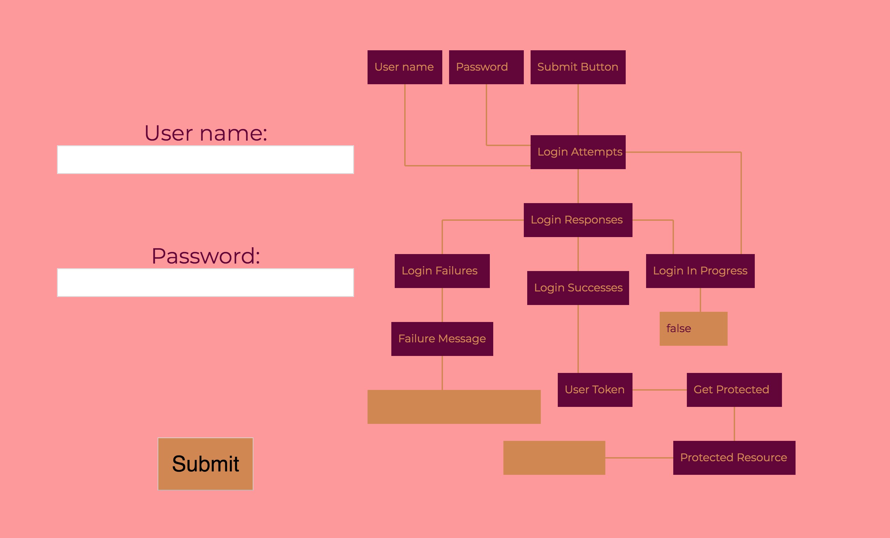

[](https://github.com/prettier/prettier)
[](https://greenkeeper.io/)
[](https://travis-ci.org/rxreact/signal)
[](https://coveralls.io/github/rxreact/signal?branch=master)

Development Sponsored By:  
[](http://www.carbonfive.com)

# Signal

This package answers to one of the most difficult questions when writing applications with RxJS: how to I build a data model for my application with observables?

Existing data modeling solutions use RxJS to *mimic* other more well-known solutions for state management -- i.e. *how would I build Redux with RxJS*? This approach often sacrifices the power and potential of observables without providing much benefit. At the same time, working with raw observables without any framework brings up a million pitfalls -- hot vs cold, when to subscribe, how to manage dependencies and test, etc.

Signal is drawn from our experience as professional programmers at Carbon Five who use RxJS on a number of production projects, and is essentially captures our "best practices" we've developed over time for modelling data with Observables.

## Installation

In your project:

```
npm install @rxreact/signal --save
```

or

```
yarn add @rxreact/signal
```

RxJS and React are peer dependencies and need to be installed seperately

## What is a Signal Graph?

This tutorial assumes a basic knowledge of RxJS and functional reactive programming. You can start with: 

[The introduction to Reactive Programming you've been missing
](https://gist.github.com/staltz/868e7e9bc2a7b8c1f754)

[Egghead Courses](https://egghead.io/courses/introduction-to-reactive-programming)

Let's explore the idea of a Signal Graph by building something we use all the time: a login form.



A login form will need an entry for your credentials and a way to submit. You probably want to display feedback from the server about incorrect logins, and maybe you also want to disable clicking submit while a login is in progress.

So how do we model this with observables? We'll let's start with what we have - three streams of data from user inputs. We can track every thing the user types in each text field, and we can track clicking on a submit button.

From there, we can probably come up with a stream of attempted logins by combining the username and password every time the user clicks the submit button.

We can use those to kick off API calls to a server, which will eventually result a stream of responses.

From there we can derive more things -- we can seperate successes and failures from the response stream, and we can derive whether a login is progress from the time between a login attempt and a login response. 

We can extract useful data from our success and failure streams -- the error messages returned from the server and maybe an auth token that comes back in a success login response.

And finally later on we can use the auth token stream to trigger a fetch of a protected resource since the next screen after a login is usually to display some personalized data.

We've built up a series of streams, starting from our `primary signals` which are our user inputs. The network of these connected observables is called a signal graph. The signals are the emissions from observables, and the graph is how they're all tied together. This is how we can architect programs with Observables. Our programs become a series of reactive data streams, starting with primary signals and extending to all the derivations based on those primary signals. Taken together, those form a signal graph.

Signal graphs are a concept. Your observables together form a signal graph whether or not you use this library. However, using this library to directly define your signal graph will help you think about your design, and solve a number of potential pitfalls you're likely to encounter writing production code with observables.

## Usage

In traditional RxJs, we'd define a series of signals manually:

```javascript
const username$ = new Subject();
const password$ = new Subject();
const submitButton$ = new Subject();

const loginAttempts$ = submitButton$.pipe(withLatestFrom(username$, password$));

const loginResponses$ = loginAttempts$.pipe(
  mergeMap(([_, username, password]) => api.login(
    username,
    password
  ))
);
```

The first issue this presents is testing -- `loginResponse$` is dependent on several of the other signals and difficult to test. We can solve this by switch to factory functions:

```typescript
const makeLoginAttempts = (
    submitButton$: Observable<void>,
    username$: Observable<string>,
    password$: Observable<string>
  ) => submitButton$.pipe(withLatestFrom(username$, password$))
  
const makeLoginResponses = (loginAttempts$: Observable<[void, string, string]>, api: API) =>
    loginAttempts$.pipe(flatMap(([_, username, password]) => api.login({ username, password })))
```

But now have to wire up all that DI manually in our regular code.

This library provides a DSL for succinctly defining graphs:

```typescript

  type SignalsType = {
    username$: string
    password$: string
    submitButton$: void
    loginAttempts$: [void, string, string]
    loginResponses$: LoginResponse
    loginInProgress$: boolean
    loginSuccesses$: LoginSuccess
    loginFailures$: LoginFailure
    loginFailureMessage$: string
    authStatus$: AuthStatus
  }

  type Dependencies = {
    api: API
  }

  const signalGraph = new SignalGraphBuilder<SignalsType, Dependencies>()
    .define(addPrimary('username$'))
    .define(
      addPrimary('password$'),
      addPrimary('submitButton$'),
      addDependency('api', api),
      addDerived('loginAttempts$', makeLoginAttempts, 'submitButton$', 'username$', 'password$'),
      addDerived('loginResponses$', makeLoginResponses, 'loginAttempts$', 'api'),
      addDerived('loginInProgress$', makeLoginInProgress, 'loginAttempts$', 'loginResponses$'),
      addDerived('loginSuccesses$', makeLoginSuccesses, 'loginResponses$'),
      addDerived('loginFailures$', makeLoginFailures, 'loginResponses$'),
      addDerived(
        'loginFailureMessage$',
        makeLoginFailureMessage,
        'loginAttempts$',
        'loginFailures$'
      ),
      addDerived('authStatus$', makeAuthStatus, 'loginSuccesses$')
    )
    .initializeWith({
      loginInProgress$: false,
      loginFailureMessage$: '',
      username$: '',
      password$: '',
      authStatus$: { status: 'unauthorized' }
    })
    .build()
```

We describe dependencies, provide factory functions, and the whole graph is built for us when we call `build`. We don't even have to define Subjects for our primary signals. It detects cyclic dependencies and missing signals. We can hydrate the graph with an initial state. For those following the subtleties of hot/cold observables, all observables in this graph have `shareReplay(1)` called on them, because this makes our graph behave like a predicatable state machine. In fact, other than by injecting outside dependencies, the graph is purely functional.


### Getting signals in an out of the graph

Once your graph is built, you can extract any signal by calling:

```typescript
signalGraph.output(`loginAttempts$`)
```

This will give you an observable that emits values for that node on the graph.

If you want to put new data into one of the primary signals, call:

```typescript
signalGraph.input(`username$`)
```

This will give you a Subject that you can call `next()` on to cause that signal to emit new values.

If you use React for your UI, make sure to check out [@rxreact/signal-connect](https://github.com/rxreact/signal-connect) which makes connecting signal graphs to React components super easy!

### Connecting multiple graphs

While it's possible to model an entire application as one signal graph, in practice that graph will get huge in a production application. So it's nice often to seperate graphs by different major domains or feature areas of your application. However, in this case you need to connect the graphs, and `@rxreact/signal` lets you do that.

Let's say you had a second graph for a protected area of the application:

```typescript
const protectedAreaGraph = new SignalGraphBuilder<
  {
    userToken$: string
    authStatus$: AuthStatus
    protected$: string
  },
  { api: API }
>()
  .define(
    addPrimary('authStatus$'),
    addDerived('userToken$', makeUserToken, 'authStatus$'),
    addDependency('api', api),
    addDerived('protected$', makeProtected, 'userToken$', 'api')
  )
  .initializeWith({
    protected$: ''
  })
  .build()
```

Now you want to connect outputs of `authStatus$` from your authentication graph to inputs of `authStatus$` in your protected area graph. You can do this easily:

```typescript
protectedAreaGraph.connect(
  'authStatus$',
  signalGraph,
  'authStatus$'
)
```

### Typescript FTW

While `@rxreact/signal` can be used with just javascript, if you use Typescript you get a number of added bonuses, in the form of super strong type checking. You can see from the examples above that `SignalGraphBuilder` takes two generic parameters that specify the types of your signals and the types of your external dependencies. Once you've done that, all of your definition code has very strong type checking. If you type a signal name wrong, you'll get an error. If the signal you reference as a dependency doesn't match the type expected by the factory function, you'll get an error. It becomes quite difficult to write a graph incorrectly!

### Caveat Emptor

This libraries are still in very in development and the typings require Typescript 3.1 which isn't even out yet. Feel free to expiriment but beware production usage!

Expect though that development will continue and this will be a production-grade library in the future!

## Enjoy!
